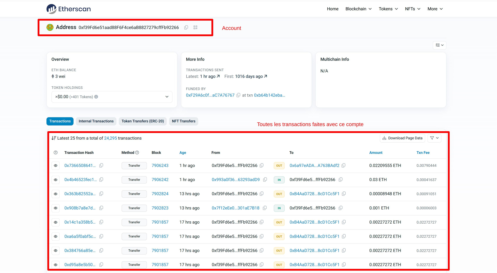

https://dashboard.alchemy.com/
Permet d'interagir avec le réseau Ethereum (Sepolia) sans devoir gérer ton propre nœud.

### Alchemy:
Alchemy fournit un nœud Ethereum clé en main, accessible via une URL RPC.
Dans le fichier hardhat.config.js (ligne sepolia).

### Hardhat:
Hardhat est un framework qui permet de développer, tester et déployer des smart contracts.
Hardhat va utiliser l’URL RPC fournie par Alchemy (stockée dans .env) pour envoyer ses transactions.

### Endpoint RPC:
Un Remote Procedure Call (RPC) est une manière d’envoyer des requêtes à un serveur distant pour 
exécuter des commandes. Dans le contexte d’Ethereum, un endpoint RPC est une URL qui permet de communiquer 
avec un nœud Ethereum afin d’envoyer des transactions, lire des données ou exécuter des smart contracts.

### Sepolia Etherscan :
https://sepolia.etherscan.io/
Est explorateur de blockchain pour le réseau de test Sepolia d’Ethereum. Il permet de visualiser tout ce qui se passe
sur la blockchain : transactions, smart contracts, adresses, blocs, etc.
#### Ce que tu peux voir sur Sepolia Etherscan :
🔹 Transactions → Vérifier l’état (succès, échec, en attente)\
🔹 Adresses Ethereum → Suivre le solde et l’historique d’une adresse\
🔹 Smart Contracts → Voir le code source et interagir avec les fonctions\
🔹 Blocs → Voir la confirmation des transactions par les mineurs

`(.venv) ➜  deployment git:(main) ✗ npx hardhat run deploy.js --network hardhat       
`
`Deploying contracts with the account: 0xf39Fd6e51aad88F6F4ce6aB8827279cffFb92266`
`FortyTwo42 deployed to: 0x5FbDB2315678afecb367f032d93F642f64180aa3`  
`Solde de l'adresse du propriétaire (deployer): 1000000.0 tokens
`\

**En déployant le contrat, le programme nous print deux adresses :** 
- l'adresse du compte avec laquelle le contract a été déployé\
- et et l'adresse du contrat

_Ici un exemple d'un compte :_

#### Cas concret : Déploiement d’un smart contract
Quand tu déploies un smart contract avec Hardhat et Alchemy, tu obtiens une adresse de contrat. 
Tu peux copier cette adresse et la rechercher sur Sepolia Etherscan pour voir :\
✅ Si le contrat a bien été déployé\
✅ Toutes les transactions qui l’ont concerné\
✅ Son code source (si vérifié)

#### Pourquoi c’est utile en testnet ?
Pour verifier si ton contrat fonctionne et intéragir avec lui

# FortyTwo42 Token

## Description

FortyTwo42 (FT42) est un token ERC-20 développé sur la blockchain Ethereum. 
Ce projet a pour but de créer un token respectant les contraintes de nommage imposées (incluant "42") 
et de fournir un exemple fonctionnel d'un contrat intelligent déployé sur un réseau de test.

## Choix Techniques

Blockchain : Ethereum (Testnet Sepolia)

Langage : Solidity 0.8.22

Framework de développement : Hardhat

Bibliothèques : OpenZeppelin (ERC-20, Ownable)

Déploiement : Réseau Sepolia via Hardhat

Explorateur de blockchain : Etherscan Sepolia

Service d'accès à Ethereum : Alchemy

## Installation et Déploiement

### Prérequis

Node.js et npm installés

Un compte sur Alchemy pour obtenir une clé API

Un portefeuille Ethereum avec des ETH de test sur Sepolia

### Étapes

Cloner le dépôt

git clone <repo_url>
cd <repo_directory>

Créer un fichier .env avec votre clé privée et l'URL RPC d'Alchemy :

RPC_URL=<votre_url_rpc>
PRIVATE_KEY=<votre_cle_privee>

Exécuter le script d'installation et de déploiement

chmod +x script.sh
./script.sh
(Qui run npx hardhat run ./deploy.js --network sepolia entre autre)

## Sécurité

La clé privée ne doit jamais être exposée publiquement.

Les privilèges de propriété sont limités via OpenZeppelin Ownable.

Le contrat est optimisé pour limiter les gas fees.

Vérification du déploiement

Après le déploiement, vous pouvez voir votre contrat sur Sepolia Etherscan et interagir avec ses fonctions via l'interface publique.

Ce projet a été conçu à des fins éducatives et expérimentales uniquement. ⚡

